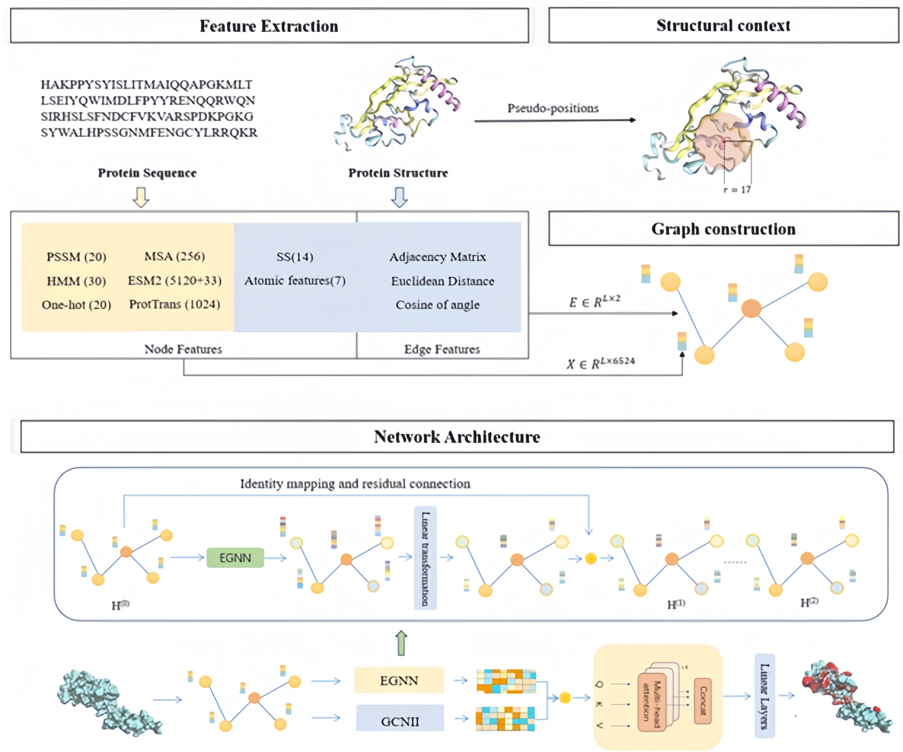

# EGPDI: identifying Protein-DNA binding sites based on multi-view graph embedding fusion


## Abstract
Mechanisms of protein-DNA interactions are involved in a wide range of biological activities and processes. Accurately identifying binding sites between proteins and DNA is crucial for analyzing genetic material, exploring protein functions, and designing novel drugs. In recent years, several computational methods have been proposed as alternatives to time-consuming and expensive traditional experiments. However, accurately predicting protein-DNA binding sites still remains a challenge. Existing computational methods often rely on handcrafted features and a single-model architecture, leaving room for improvement. We propose a novel computational method, called EGPDI, based on multi-view graph embedding fusion. This approach involves the integration of Equivariant Graph Neural Networks (EGNN) and Graph Convolutional Networks II (GCNII), independently configured to profoundly mine the global and local node embedding representations. An advanced gated multi-head attention mechanism is subsequently employed to capture the attention weights of the dual embedding representations, thereby facilitating the integration of node features. Besides, extra node features from protein language models are introduced to provide more structural information. To our knowledge, this is the first time that multi-view graph embedding fusion has been applied to the task of protein-DNA binding site prediction. The results of 5-fold cross-validation and independent testing demonstrate that EGPDI outperforms state-of-the-art methods. Further comparative experiments and case studies also verify the superiority and generalization ability of EGPDI.


<div align=center>

</div>


## Preparation
### Environment Setup
The repo mainly requires the following packages.
+ torch==1.13.1
+ torch==1.13.1
+ torch_geometric==2.3.1
+ torch_scatter==2.0.9
+ torch_sparse==0.6.18
+ dgl==0.9.1
+ numpy==1.24.3
+ pandas==1.5.3
+ scikit-learn==1.3.0
+ scipy==1.10.1
+ seaborn==0.13.0

## Experimental Procedure
### Create Dataset
**Firstly**, run the script below to create node features(PSSM,HMM,SS,AF,One-hot encoding). The file can be found in scripts folder.
```python 
python3 data_io.py 
```

**Secondly** , run the script below to create node features(ESM2 embeddings and ProtTrans embeddings). The file can be found in feature folder.</br>

```python 
python3 ESM2.py 
```
```python 
python3 ProtTrans.py 
```
We choose the esm2_t48_15B_UR50D pre-trained model of ESM-2, which has the most parameters. More details about it can be found at: https://huggingface.co/facebook/esm2_t48_15B_UR50D   </br>
We also choose the prot_t5_xl_uniref50 pre-trained model of ProtTrans, which uses a masked language modeling(MLM). More details about it can be found at: https://huggingface.co/Rostlab/prot_t5_xl_uniref50    </br>

**Thirdly**, run the script below to create edge features. The file can be found in feature folder.
```python 
python3 create_edge.py 
```

**And if you want to skip the long time preparation, please directly download the node_features and edge_features files which we already generated from** https://drive.google.com/drive/my-drive </br>

### Model Training
Run the following script to train the model.
```python
python3 train_val_bestAUPR_predicted.py 
```
**We also provide pre-trained models at** https://drive.google.com/drive/my-drive  </br>

### Inference on Pretrained Model
Run the following script to test the model.
```python
python3 test_129_final.py 
```
```python
python3 test_181_final.py 
```
Both test datasets, DNA_129_Test and DNA_181_Test , were included in the testing of the model.
